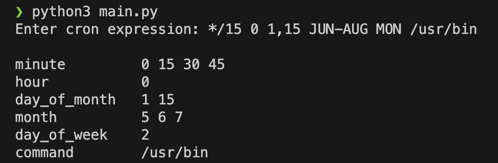

# Cron Expression Parser

This Python script provides a simple way to parse and interpret cron expressions. It breaks down the standard cron expression into specific fields, such as minutes, hours, days of the month, months, and days of the week, and then expands those fields into the corresponding values.

## Features

- Parses and interprets standard cron expressions.
- Validates field values based on allowed ranges and special characters.
- Outputs the expanded fields in a formatted manner.

## Usage

To use the Cron Expression Parser, follow these steps:

1. Clone or download the repository.
2. Call the `` python3 main.py``

## Running Tests

``pip3 install -r requirements.txt``

``pytests tests/``

# Cron Expression Field Constraints

| Field          | Required | Allowed Values          | Allowed Special Characters |
|----------------|----------|-------------------------|----------------------------|
| Minutes        | Y        | 0-59                    | , - * /                    |
| Hours          | Y        | 0-23                    | , - * /                    |
| Day of month   | Y        | 1-31                    | , - * ? /                  |
| Month          | Y        | 0-11 or JAN-DEC         | , - * /                    |
| Day of week    | Y        | 1-7 or SUN-SAT          | , - * ? /                  |
